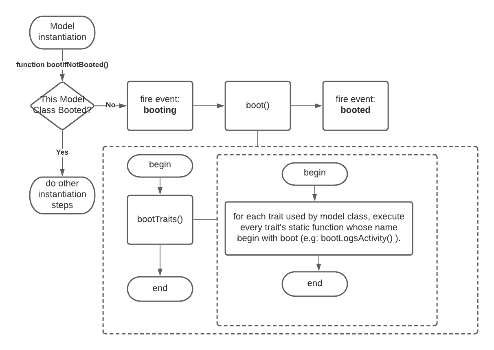

# Model

## model's boot

In a request life cycle, if any model are instantiating, it will first call `bootIfNotBooted()` function to boot the model class. As the function name indicates, it would execute boot process if this model **class** was not booted in this request life cycle.


model boots is on the class level, not instance level. That means the same class of models at most boots once in one request cycle.


How to execute boot process? look at `bootTraits()` function here:

it will find all traits current model used \(_all traits used by a class, its parent classes and trait of their traits_\),  and **execute every trait's static function whose name is "boot\[Trait-Name\]"**. e.g:

 `protected static function bootLogsActivity()` in `LogsActivity` trait 


Only when instantiating a model, and this model class has not booted before in current request life cycle, it would boot! 



booted Model classes \(class full name\) are recorded in Model's static property`$booted` \(Model::booted\)


